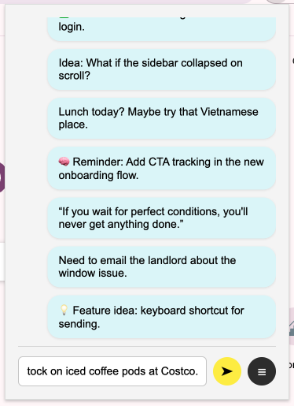

# Chat to Myself (Chrome Extension)

A lightweight, offline-first chat tool that lets you type messages to yourself in a popup — just like sending messages to a journal, todo, or idea scratchpad.



---

## 🧠 Features

- 💬 Type and save messages locally using `chrome.storage.local`
- 🔁 Messages appear newest-first (top to bottom)
- 🗃 Export full chat history to a `.txt` file
- 🧹 Clear messages with optional save
- 🌈 Simple, distraction-free UI
- 💻 Built with React + Vite for fast loading

---

## 🛠 Setup

### 1. Clone and install

```bash
git clone https://github.com/insuckcha/chat-to-myself-extension.git
cd chat-to-myself-extension
npm install
